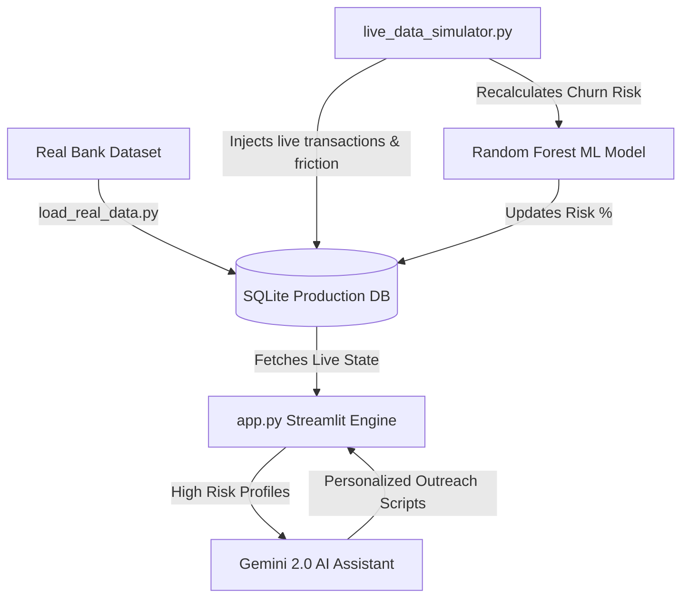

# Churn Predictor on Real Data

  <strong>Live Application:</strong> <a href="https://churn-predictor-real-data.onrender.com">View Live App</a>

This repository contains a full-stack financial technology application built for predicting and analyzing customer churn using real operational data. The system combines machine learning with an executive dashboard to provide actionable retention strategies.

## Overview

The application acts as an enterprise churn operating system. It ingests customer profiles and transaction histories to calculate real-time flight risk using a Random Forest machine learning model. Furthermore, it integrates a generative AI assistant that drafts personalized rescue outreach scripts for high-risk customers, allowing customer success teams to act quickly.

## Features

- **Live Data Ingestion:** Connects securely to a PostgreSQL database to fetch real customer metrics, handling missing values and duplicate records automatically.
- **Machine Learning Automation:** Features a background script that pulls recent data, trains a new predictive model, and automatically updates the system if the new model achieves higher accuracy.
- **Premium User Interface:** A professional, fully custom dark mode dashboard built with Streamlit, optimized for real-time monitoring without full page reloads.
- **Demo Mode Fallback:** If the primary database goes offline, the application seamlessly switches to a local offline mode, ensuring uninterrupted demonstrations.
- **Automated AI Recovery:** Automatically flags customers and generates customized, context-aware apology and retention emails using integrated generative AI.

## Getting Started

1. Clone this repository.
2. Ensure you have Python installed.
3. Install dependencies by running `pip install -r requirements.txt`.
4. Copy your database credentials to the `.env` file.
5. Launch the dashboard locally by running `streamlit run app.py`.

## Architecture

The project is structured into three main phases:
- **Data Engineering:** Migrates data processing from static files to a resilient relational database setup.
- **Predictive Analytics:** Processes user data and friction points (e.g., failed transactions) to output a dynamic churn risk probability.
- **Automated Insights:** Converts predictive numbers into executive summaries and actionable customer outreach plans.